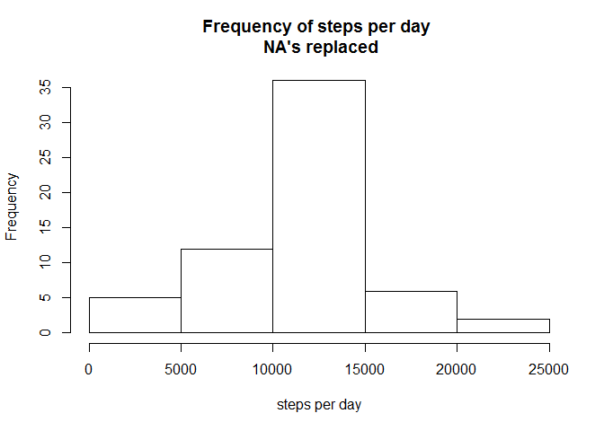
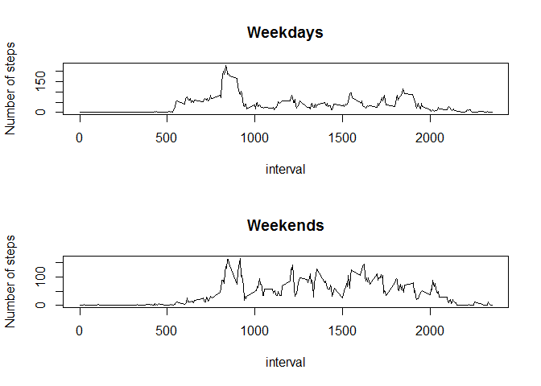

# Reproducible Research: Peer Assessment 1


## Loading and preprocessing the data

```r
suppressWarnings(suppressMessages(library(dplyr)))
setwd("D:/Data Science Course/Assignments/Activity Monitoring/RepData_PeerAssessment1")
activity <- read.csv(unz("activity.zip", "activity.csv"))
```


## What is mean total number of steps taken per day?

```r
steps<-activity %>% 
    group_by(date) %>%
    summarise(totalsteps = sum(steps,na.rm=TRUE))
#hist(steps$totalsteps, xlab="steps per day", main = "Frequency of steps per day")

print(summary(steps$totalsteps))
```

```
##    Min. 1st Qu.  Median    Mean 3rd Qu.    Max. 
##       0    6778   10400    9354   12810   21190
```


## What is the average daily activity pattern?

```r
pattern<-activity %>%
    group_by(interval) %>%
    summarise(average=mean(steps,na.rm=TRUE))
#plot(x=pattern$interval, y=pattern$average, type="l",
#     main="daily steps per 5 minute time interval", ylab="steps",xlab="time #interval")
maxinterval<-which.max(pattern$average)
print(pattern[maxinterval,])
```

```
## Source: local data frame [1 x 2]
## 
##   interval  average
##      (int)    (dbl)
## 1      835 206.1698
```


## Imputing missing values

```r
nna<-sum(is.na(activity$steps))
print(nna)
```

```
## [1] 2304
```

```r
getAverage<-function(interval){
    index<-which(pattern$interval==interval)
    if (length(interval)==0){
      stop("BAD INDEX")  
    }
    if (length(interval)>1){
      stop(paste("BAD INDEX",toString(interval)))  
    }
    if (index<1 || index>288){
        stop("BAD INDEX")  
    }
    result<-pattern$average[index]
    if (is.na(result)){
        stop("NA")
    }
    result
}

activity2<-activity
for(i in 1:length(activity2$steps)){
    if (is.na(activity2$steps[i])){
        activity2$steps[i]<-getAverage(activity2$interval[i])
    }  
}

steps<-activity2 %>% 
  group_by(date) %>%
  summarise(totalsteps = sum(steps,na.rm=TRUE))

#hist(steps$totalsteps, xlab="steps per day", main = "Frequency of steps per day \n #NA's replaced")

print(summary(steps$totalsteps))
```

```
##    Min. 1st Qu.  Median    Mean 3rd Qu.    Max. 
##      41    9819   10770   10770   12810   21190
```


## Are there differences in activity patterns between weekdays and weekends?

```r
getWeekday<-function(d){
    switch(d,
           "Monday" = "weekday",
           "Tuesday" = "weekday",
           "Wednesday" = "weekday",
           "Thursday" = "weekday",
           "Friday" = "weekday",
           "Saturday" = "weekend",
           "Sunday" = "weekend")
}

activity2<-activity2 %>%
      mutate(kind=weekdays(as.Date(date,format="%Y-%m-%d"))) 

for(i in 1:length(activity2$steps)){
    activity2$kind[i]<-getWeekday(activity2$kind[i])  
}
activity2$kind<-as.factor(activity2$kind)

patternweekday<-activity2 %>%
  filter(kind=="weekday") %>%
  group_by(interval) %>%
  summarise(average=mean(steps,na.rm=TRUE))

patternweekend<-activity2 %>%
  filter(kind=="weekend") %>%
  group_by(interval) %>%
  summarise(average=mean(steps,na.rm=TRUE))

#par(mfrow=c(2,1)) 
#plot(patternweekday$interval, patternweekday$average,type="l",
#     xlab="interval", ylab="Number of steps", main="Weekdays")
#plot(patternweekend$interval, patternweekend$average,type="l",
#     xlab="interval", ylab="Number of steps", main="Weekends")
```

